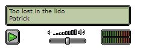

# Javascript Trax Player
## About
This repository is an attempt to recreate the Trax Player originally a Flash(.swf) embedded element as seen below in pure Javascript. 


At the moment its working and its looking like this.




## How to use 

### Data
Your API Should return something like this data

```text
status=0&name=Too lost in the lido&author=Patrick&track1=317,4;408,7;0,1;410,16;413,4;406,4;410,8;412,4&track2=0,2;321,2;443,22;91,2;317,8;443,8;412,2;0,2&track3=0,3;320,2;0,7;414,4;445,4;412,2;323,2;412,4;96,2;412,2;414,4;445,7;448,1;317,4&track4=0,3;324,2;0,6;448,1;0,6;96,2;322,4;96,2;99,2;322,4;412,2;0,2;322,2;96,2;322,2;0,1;324,2;0,3
```

The data should be based on the dynamic values probably in a database somewhere.
If your trax is a single string your need to split out the string into the different tracks. The different tracks can be sepereated by the semicolons and their track number.


### Embed the stylesheet

```html
<link href="css/style.css" rel="stylesheet">
```

### Add the HTML

```html
<div class="trax-player" id="trax-player">
    <div class="display">
        <div class="loading"></div>
        <div class="display-inner">
            <div class="title"></div>
            <div class="author"></div>
            <div class="time"><span class="length"></span></div>
        </div>

    </div>
    <div class="control">
        <button class="play-btn" onClick={_traxPlayer.Play()}>Play</button>
    </div>
    <div class="volumecontainer">
        <div class="volume-indicator">
            <div class="volume-indicator-filled">
                <div class="volume-indicator-filled-bg"></div>
            </div>
        </div>
        <input type="range" min="0" max="100" value="50" class="volume">
    </div>
    <div class="music-activity"></div>
</div>
```

### Springle some javacript on it 

```javascript
var _traxPlayer = new TraxPlayer("SONGURL", "DIRECTORY_FOR_MP3"); 

(async () => {
    await _traxPlayer.Preload();
})()
.catch(error => {
    console.log(error);
});
```


## Web-Component

Use: [blob/main/web-component/release/habbo-traxplayer.es.js`](/web-component/release/habbo-traxplayer.es.js)

```html
<script src="./web-component/release/habbo-traxplayer.es.js" type="text/javascript"></script>
```

```html
<habbo-traxplayer sampleUrl="DIRECTORY_FOR_MP3" songUrl="URL_FOR_SONG" />
```
